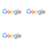

# Node-canvas

## Quick start

### Setup

```
npm install
```

### Commands

```
PS C:\Users\node-canvas-image-grid> node index.js -h
Usage: index [options]

Options:
  -i, --inputs [strings...]     input filenames
  -o, --output <string>         output filename
  -r, --resolution [number...]  output resolution [width,height]
  -p, --padding [number...]     padding [x,y]
  -h, --help                    display help for command
```

### Example

```
node index.js -i https://www.google.com/images/branding/googlelogo/2x/googlelogo_color_92x30dp.png https://www.google.com/images/branding/googlelogo/2x/googlelogo_color_92x30dp.png https://www.google.com/images/branding/googlelogo/2x/googlelogo_color_92x30dp.png -o ./output.png -r 100 100 -p 10 1
```


